<!-- Header Banner -->

 

<!-- Social badges -->

---

 

### `> whoami`

Backend developer from Ukraine building reliable infrastructure for Web3. Currently working at **[AirDAO](https://airdao.io)** — crafting scalable blockchain solutions. I'm passionate about clean code, distributed systems, and anything that runs fast and never goes down.

 

### `> tech --stack`

<table>
<tr>
<td width="50%" valign="top">

**Languages**

**Backend & Frameworks**

</td>
<td width="50%" valign="top">

**Databases**

**DevOps & Tools**

</td>
</tr>
</table>

 

### `> stats --github`

|  |  |
|---|---|

 

 

### `> trophies --display`

 

---

*"Any sufficiently advanced backend is indistinguishable from magic."*

